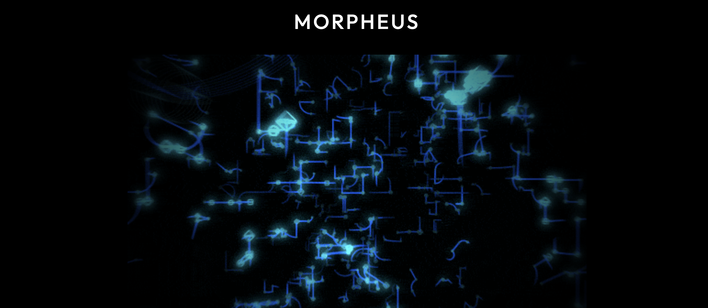

# Morpheus

**[Live Demo →](https://avanith12.github.io/Morpheus/)**

An interactive 3D particle visualization that morphs between different shapes and responds to your interactions in real-time.



Built with Three.js, this lets you play with particles that can form spheres, cubes, DNA helixes, hearts, and even custom text - all while reacting to audio and creating mesmerizing visual effects.

## What it does

- **Morph shapes**: Switch between Cloud, Sphere, Cube, Torus, DNA, Spiral, Heart, Star, Infinity, or custom text
- **Click particles** to send pulses through the network
- **Hold Shift and drag** to attract particles to your cursor
- **Hold Ctrl and drag** to repel them
- **Audio reactive mode** - particles respond to your microphone input
- **3 color themes**: Deep Ocean (cyan), Cyber Pulse (magenta), Frozen Void (teal)
- **Customizable everything** - particle count, size, trails, bloom effects, and more via the control panel

## Running it

Just open `index.html` in any modern browser. That's it.

If you need a local server:

```bash
# Python 3
python -m http.server 8000

# Or use VS Code's Live Server extension
```

Then go to `http://localhost:8000`

## Controls

- **Left click**: Fire pulse from particle
- **Shift + drag**: Attract particles
- **Ctrl/Right click + drag**: Repel particles
- **Mouse drag**: Rotate camera
- **Scroll**: Zoom

Open the Tweakpane panel on the right to tweak everything else.

## Tech

- Three.js r128 for 3D rendering
- UnrealBloomPass for the glow effects
- OrbitControls for camera
- Tweakpane for the GUI
- Web Audio API for audio reactivity

## How it works

The app creates a particle system using Three.js BufferGeometry for performance. Each particle has a target position based on the selected shape, and it smoothly transitions when you switch shapes. Lines connect nearby particles to create the network effect.

Click a particle and it fires a pulse that propagates through connected particles. The gravity wells use raycasting to convert mouse position to 3D space and apply forces to particles.

---

Made with Three.js. No frameworks, no build process, just pure JavaScript.
